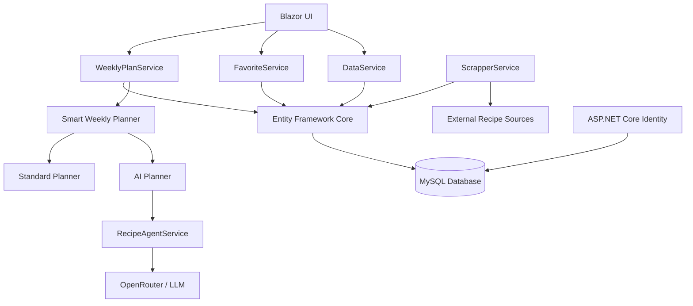
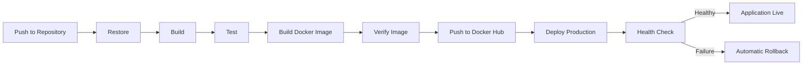

# 🍽️ Recipe Finder

A full-stack recipe management and meal-planning web application built with **C#, ASP.NET Core, Blazor, Entity Framework Core and MySQL**.

Recipe Finder started as a recipe aggregation project and has gradually evolved into a larger production application covering recipe discovery, personalized weekly meal planning, shopping workflows, AI-assisted plan generation, automated testing and a complete Docker-based CI/CD deployment pipeline.

🌐 **Live application:**  
https://www.recipefinderwebapp.com/

---

## 🚀 Project Overview

Recipe Finder collects recipes from multiple external sources, transforms them into a consistent internal data model and stores them in a relational MySQL database.

Authenticated users can search recipes, manage favorites, generate personalized weekly meal plans, create shopping lists, rate recipes and interact with user-specific features.

The project focuses on solving real application problems rather than simply displaying recipe content. Over time, this has included database design, web scraping, authentication, asynchronous processing, AI integration, application architecture, testing, containerization and automated production deployment.

---

## ✨ Main Features

### 🔎 Recipe Discovery

Recipes are collected from multiple external recipe websites through custom scraping logic.

Recipe data is parsed, normalized and stored locally so previously discovered recipes can be served directly from the application's database instead of being scraped again.

The application handles structured information such as:

* Recipe name
* Ingredients and quantities
* Preparation instructions
* Cooking time
* Difficulty
* Cuisine
* Nutrition information

---

### ❤️ Favorites

Authenticated users can save and remove recipes from their personal favorites collection.

Favorites also play an important role in weekly meal planning and can be prioritized when personalized plans are generated.

---

### 📅 Smart Weekly Planner

Recipe Finder includes a **Smart Weekly Planner** that generates and persists a personalized seven-day meal plan for each user.

The planner supports:

* Seven-day meal plans
* User-specific plans
* Maximum calories per recipe
* Maximum preparation time
* Preferred number of favorite recipes
* Plan persistence
* Expiration logic
* Forced plan regeneration
* Notifications when a new weekly plan can be created

Weekly plans are stored in the database instead of existing only inside the UI session.

The Smart Weekly Planner first attempts AI-assisted generation. If the external AI service is unavailable, rate-limited or cannot be used because of configuration or usage limitations, Recipe Finder automatically falls back to the application's internal weekly plan generator.

```text
Smart Weekly Planner
        │
        ▼
   Try AI Planner
        │
   ┌────┴────┐
   │         │
Success   AI unavailable
   │         │
   ▼         ▼
AI Plan   Standard Generator
   │         │
   └────┬────┘
        ▼
   Weekly Plan
```

This keeps weekly planning available even when the external AI provider cannot be reached.

---

## 🤖 AI-Assisted Weekly Planning

AI-assisted weekly planning is integrated into the production Smart Weekly Planner using an external Large Language Model through **OpenRouter**.

Instead of sending the entire recipe database directly to the model, the application first filters and prepares a limited collection of suitable recipe candidates.

Recipe entities are mapped into lightweight DTOs containing only information relevant to the planning process.

The AI service receives the candidate collection and returns a structured selection of recipe IDs.

### AI Planning Flow

```text
Recipe Database
      │
      ▼
Preference Filtering
      │
      ▼
Candidate Selection
      │
      ▼
RecipeAgentDto Mapping
      │
      ▼
Limited Candidate Set
      │
      ▼
OpenRouter / LLM
      │
      ▼
Structured Recipe IDs
      │
      ▼
Application Validation
      │
      ▼
Weekly Plan
```

The application validates the AI response before saving anything.

It verifies that:

* The expected number of recipes was returned
* Recipe IDs are unique
* Every returned ID belongs to the original candidate collection
* Every selected recipe exists in the database

The AI output is therefore treated as a suggestion that must pass application-level validation before being persisted.

If the AI provider is unavailable, the Smart Weekly Planner automatically switches to the existing internal planning engine.

---

## 🛒 Shopping List

Recipes can be connected to a user's shopping workflow.

Ingredients can be added to a personal shopping list while users can also mark ingredients they already have.

The shopping system is designed around structured ingredient data rather than plain recipe text, allowing ingredients to be reused by other application features.

---

## ⭐ Ratings & Reviews

Authenticated users can rate recipes and leave written reviews.

Recipe ratings can then be aggregated to provide an average rating for each recipe.

---

## 👤 Authentication & User Data

Authentication is implemented using **ASP.NET Core Identity**.

Application data is associated with authenticated users so features such as favorites, weekly plans, preferences and shopping lists remain private and persistent between sessions.

---

# 🏗️ Architecture

Recipe Finder uses a service-oriented structure to separate UI concerns from application and data-access logic.

Most business logic is handled outside Blazor components so UI components remain focused primarily on presentation and user interaction.



### Core Responsibilities

**DataService**  
Handles database communication and retrieval of user-related application data.

**ScrapperService**  
Fetches and parses recipe information from external sources and transforms it into application entities.

**WeeklyPlanService**  
Handles weekly-plan generation, persistence, preferences, expiration, regeneration and Smart Planner orchestration.

**FavoriteService**  
Handles favorite recipes and related user functionality.

**RecipeAgentService**  
Transforms recipe entities into lightweight DTOs used by the AI planning workflow.

**OpenRouterService**  
Handles communication with OpenRouter, structured AI responses and provider availability errors.

---

## 🧠 Smart Planner Architecture

The UI does not need to decide whether AI or the standard generator should be used.

It calls a single Smart Planner entry point:

```text
Blazor UI
    │
    ▼
GenerateSmartWeeklyPlanAsync()
    │
    ├── GenerateAiWeeklyPlanAsync()
    │           │
    │           ▼
    │      OpenRouter / LLM
    │
    └── GenerateWeeklyPlanAsync()
            Standard fallback
```

The AI integration is therefore an enhancement rather than a single point of failure for weekly planning.

---

# 🧰 Tech Stack

### Backend

`C#`  
`ASP.NET Core`  
`.NET 8`  
`Entity Framework Core`  
`LINQ`

### Frontend

`Blazor`  
`Razor Components`  
`HTML`  
`CSS`  
`Bootstrap`

### Database

`MySQL`

### Authentication

`ASP.NET Core Identity`

### AI Integration

`OpenRouter API`  
`Large Language Models`  
`Structured JSON responses`  
`DTO-based candidate preparation`  
`Application-level AI validation`  
`Automatic standard-generator fallback`

### Testing

`xUnit`  
`.NET Test`

### DevOps & Deployment

`Docker`  
`Docker Hub`  
`Jenkins`  
`Linux VPS`  
`Git`  
`GitHub`

---

# 🧪 Automated Testing

Recipe Finder contains a dedicated test project:

```text
RecipeFinderTest
```

Tests are executed automatically as part of the CI/CD process.

A production Docker image is created only after the solution successfully restores, builds and passes the automated test stage.

```text
Restore
   ↓
Build
   ↓
Automated Tests
   ↓
Docker Build
```

This prevents known failing builds from progressing further into the deployment pipeline.

---

# 🔄 CI/CD Pipeline

The project uses a custom **Jenkins CI/CD pipeline** for automated build, testing, container creation and production deployment.

The pipeline is defined directly in the repository through the `Jenkinsfile`.



### Pipeline Stages

```text
Checkout
   ↓
Restore Dependencies
   ↓
Build Release
   ↓
Run Automated Tests
   ↓
Build Docker Image
   ↓
Verify Docker Image
   ↓
Push Versioned Image to Docker Hub
   ↓
Deploy Production Container
   ↓
Health Check
   ↓
Production Live
```

Docker images are tagged using both the Jenkins build number and `latest`.

This provides individually identifiable production builds instead of relying only on a mutable latest image.

---

## 🔁 Deployment Rollback

The deployment pipeline includes automatic rollback protection.

Before replacing the production container, Jenkins records the currently running production image.

If deployment fails after production replacement begins, or if the newly deployed application fails its health check, Jenkins attempts to restore the previous Docker image automatically.

```text
New Version
     │
     ▼
Production Deployment
     │
     ▼
Health Check
   ┌───────┐
   │       │
Healthy   Failed
   │       │
   ▼       ▼
  Live   Rollback
           │
           ▼
   Previous Image
```

This reduces the risk of leaving the production application unavailable after a failed deployment.

---

# 🐳 Docker Deployment

The web application is packaged as a Docker image and deployed as a container on a Linux VPS.

Production configuration and secrets are kept outside the source repository and injected into the container through environment variables.

This includes sensitive values such as:

* Database credentials
* SMTP credentials
* OpenRouter API credentials
* Production-specific configuration

Docker Hub is used as the image registry between the build and production deployment stages.

---

# 📂 Solution Structure

The solution is divided into separate projects for core application classes, the web application and automated tests.

```text
Recipe-Finder/
│
├── Recipe Finder/
│   └── Core application models and shared classes
│
├── RecipeFinder WebApp/
│   ├── Components/
│   ├── Data/
│   │   └── AI/
│   ├── Migrations/
│   ├── wwwroot/
│   ├── Program.cs
│   └── Dockerfile
│
├── RecipeFinderTest/
│   └── Automated tests
│
├── Jenkinsfile
│
└── Recipe Finder.sln
```

---

# ⚙️ Getting Started

## Prerequisites

To run the project locally you will need:

```text
.NET 8 SDK
MySQL Server
Git
```

Visual Studio is recommended but not required.

---

## 1. Clone the Repository

```bash
git clone https://github.com/Stelioss4/Recipe-Finder.git
cd Recipe-Finder
```

---

## 2. Configure the Application

Create your local application configuration using the provided example configuration file.

```text
RecipeFinder WebApp/appsettings.example.json
```

Copy it to your local `appsettings.json` and configure the required values.

Configuration can include:

```text
Database connection string
SMTP configuration
OpenRouter API key
OpenRouter model
```

Sensitive production credentials should never be committed to source control.

---

## 3. Restore Dependencies

```bash
dotnet restore "Recipe Finder.sln"
```

---

## 4. Apply Database Migrations

Run Entity Framework Core migrations against your configured MySQL database.

```bash
dotnet ef database update --project "RecipeFinder WebApp"
```

---

## 5. Build the Solution

```bash
dotnet build "Recipe Finder.sln"
```

---

## 6. Run the Tests

```bash
dotnet test "RecipeFinderTest/RecipeFinderTest.csproj"
```

---

## 7. Run the Application

```bash
dotnet run --project "RecipeFinder WebApp"
```

---

# 🧠 Technical Challenges & Decisions

Recipe Finder has grown considerably since its first implementation and has required repeated refactoring as new functionality was introduced.

Some of the more interesting problems addressed during development include:

### Recipe Aggregation

External recipe websites use different HTML structures and data formats.

The scraper layer therefore requires source-specific parsing while still producing a consistent internal recipe model.

### Duplicate Recipe Handling

Recipes collected from external sources must be checked before being stored to avoid unnecessary duplicate database records.

### Relational Data Modelling

Recipes contain several related structures including ingredients, nutrition values, ratings and reviews.

User accounts also contain relationships with favorites, weekly plans, preferences and shopping-list data.

### User-Specific Persistence

Weekly plans and other personalized features need to remain associated with the correct authenticated user across sessions.

### Weekly Plan Lifecycle

A generated plan needs to remain active for the intended period while also supporting expiration and regeneration rules.

### AI Candidate Size

Sending the complete recipe database to an LLM would create unnecessary latency and token usage.

The application therefore filters, limits and transforms candidate recipes before communicating with the AI service.

### AI Response Validation

LLM responses cannot be trusted blindly.

The application validates returned recipe IDs against the original candidate set before anything is stored in the user's weekly plan.

### External AI Availability

External AI providers can become unavailable, rate-limited or inaccessible because of usage limitations.

The Smart Weekly Planner therefore falls back to the application's internal generator when the AI service cannot be used.

### Dependency Changes and Testability

Introducing new services such as the AI integration required adapting existing services and tests without breaking the application's dependency injection structure.

### Production Deployment

Moving from manual deployment to automated CI/CD required coordinating application builds, tests, Docker images, secrets, production containers, health verification and rollback behavior.

---

# 🎯 Purpose of the Project

Recipe Finder was originally created as a hands-on learning project while developing my skills as a .NET developer.

Instead of following a single tutorial from beginning to end, the application has evolved feature by feature by solving problems that appeared naturally as the codebase grew.

The project has given me practical experience with:

```text
C# / .NET application development
ASP.NET Core
Blazor
Entity Framework Core
Relational database design
MySQL
ASP.NET Core Identity
Dependency Injection
Web scraping
Asynchronous programming
REST API integration
AI / LLM integration
DTO design
Structured AI output validation
Fallback and resilience strategies
Unit and service testing
Docker
Linux deployment
Jenkins CI/CD
Production health checks
Automated rollback strategies
Git and GitHub workflows
```

The long-term goal is to continue improving Recipe Finder while using it as a practical environment for learning application architecture, scalability, performance and production software engineering.

---

# 🔮 Planned Improvements

Recipe Finder continues to evolve.

Areas currently being explored include improved application architecture, database-query performance, scalability for data-heavy pages, more advanced Smart Planner recommendation logic, nutrition-aware planning and a master weekly shopping-list system that can aggregate ingredients across an entire weekly meal plan.

---

# 🎥 Demo

The live application can be accessed here:

**https://www.recipefinderwebapp.com/**

A demonstration of the project is also available through my YouTube channel:

**https://www.youtube.com/@stylianosboursanidis5247**

---

# 👨‍💻 Author

**Stylianos Boursanidis**

GitHub  
https://github.com/Stelioss4

LinkedIn  
https://www.linkedin.com/in/stylianos-boursanidis-1502b32aa/

Portfolio  
https://www.steliosboursanidis.com/

---

## ⭐ Repository

If you are reviewing this repository as part of my developer portfolio, feel free to explore the source code, automated tests and `Jenkinsfile` to see how the application has evolved beyond its original recipe-search functionality.
